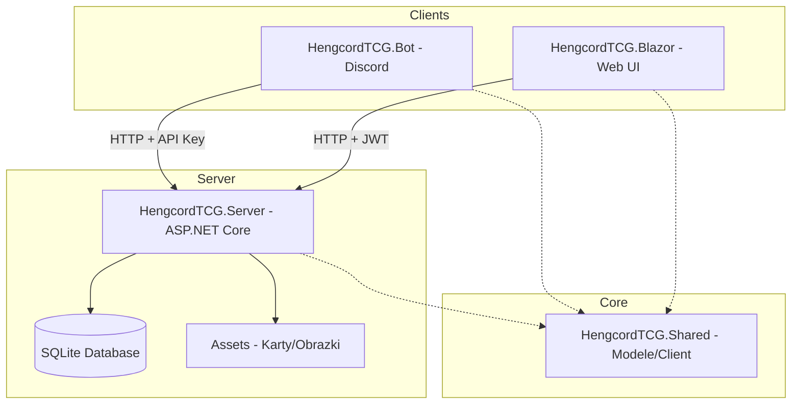

# Dokumentacja Projektu HengcordTCG

## Spis Treści
1. [Architektura](#architektura)
2. [Struktura Projektu](#struktura-projektu)
3. [Komponenty](#komponenty)
4. [Funkcjonalności](#funkcjonalności)
5. [Uruchomienie](#uruchomienie)
6. [Baza Danych](#baza-danych)
7. [API](#api)
8. [Autentykacja](#autentykacja)

---

## Architektura

Projekt HengcordTCG jest ekosystemem cyfrowej gry karcianej z pełnym stosem technologicznym, wykorzystującym architekturę API-first.



---

## Struktura Projektu

```
TCGBot/
├── HengcordTCG.sln                 # Plik rozwiązania Visual Studio
│
├── HengcordTCG.Shared/             # Wspólne modele i logika
│   ├── Models/                     # Encje EF Core
│   │   ├── Card.cs                 # Model karty
│   │   ├── User.cs                 # Model użytkownika
│   │   ├── Wiki.cs                 # Model wiki
│   │   └── ...
│   ├── Data/                       # DbContext i konfiguracja
│   │   └── AppDbContext.cs
│   ├── Clients/                    # Klient HTTP
│   │   └── HengcordTCGClient.cs
│   └── Migrations/                 # Migracje EF Core
│
├── HengcordTCG.Server/             # ASP.NET Core API
│   ├── Controllers/                # Kontrolery API
│   │   ├── CardsController.cs
│   │   ├── UsersController.cs
│   │   ├── WikiController.cs
│   │   └── ...
│   ├── Services/                   # Logika biznesowa
│   ├── Middleware/                 # Middleware (Auth, Error handling)
│   └── Program.cs
│
├── HengcordTCG.Bot/                # Discord Bot
│   ├── Commands/                   # Komendy slash
│   │   ├── GameCommands.cs
│   │   ├── ShopCommands.cs
│   │   └── ...
│   ├── Handlers/                   # Obsługa interakcji
│   ├── Game/                       # Silnik gry
│   └── Program.cs
│
└── HengcordTCG.Blazor/            # Web UI (Blazor)
    ├── Program.cs                  # Konfiguracja serwera
    ├── HengcordTCG.Blazor.Client/  # Client (WASM)
    │   ├── Pages/                   # Strony
    │   │   ├── Index.razor          # Home
    │   │   ├── Admin/               # Panel admina
    │   │   ├── Wiki.razor           # Wiki
    │   │   └── ...
    │   ├── Services/                # Serwisy Blazor
    │   └── Shared/                  # Komponenty
    └── wwwroot/                    # Static assets
```

---

## Komponenty

### HengcordTCG.Server
**Technologia:** ASP.NET Core 10.0

Główny serwer API obsługujący:
- Zarządzanie użytkownikami
- Logika sklepu i economy
- Obsługę wymiany kart
- Bazę danych kart
- Generowanie obrazów kart
- System Wiki z propozycjami

**Port:** `https://localhost:7156`

### HengcordTCG.Bot
**Technologia:** Discord.Net 3.x

Bot Discord jako główny interfejs użytkownika:
- `/daily` - Odbieranie dziennych nagród
- `/balance` - Sprawdzanie złota
- `/shop` - Kupowanie paczek kart
- `/trade` - Rynek wymiany
- `/collection` - Przeglądanie kolekcji
- `/battle` - Walki PvP

### HengcordTCG.Blazor
**Technologia:** Blazor WebAssembly

Panel webowy zbudowany na:
- **BlazorBlueprint** - Biblioteka komponentów UI
- **TailwindCSS** - Style
- **Lucide Icons** - Ikony
- **JWT Authentication** - Logowanie przez Discord OAuth

Zakładki:
- **Kolekcja** - Przeglądanie posiadanych kart
- **Sklep** - Kupowanie paczek
- **Galeria** - Wszystkie karty
- **Wiki** - Dokumentacja gry
- **Handel** - Wymiana kart z innymi graczami
- **Admin** - Panel zarządzania (tylko admini)

### HengcordTCG.Shared
Wspólny kod między projektami:
- Modele Entity Framework
- Klient HTTP (`HengcordTCGClient`)
- Enumy i DTOs

---

## Funkcjonalności

### System Kart
- **Typy kart:** Unit, Commander, Closer
- **Rzadkość:** Common, Rare, Legendary
- **Statystyki:** Attack, Defense, Health, LightCost, MinDamage, MaxDamage
- **Umiejętności:** AbilityText, AbilityId

### System Walki
- System PvP oparty na statystykach kart
- Commander jako karta dowódcy
- Closer jako karta kończąca

### System Ekonomii
- Złoto jako waluta
- Dzienne nagrody
- Kupowanie paczek
- Sprzedawanie kart

### System Wiki
- Strony wiki z hierarchią (rodzic/dziecko)
- Propozycje zmian od użytkowników
- Historia zmian
- Panel admina do zarządzania

---

## Uruchomienie

### Wymagania
- .NET 10.0 SDK
- Discord Bot Token
- Konfiguracja w `appsettings.json`

### Kolejność uruchomienia

1. **Serwer API:**
```bash
cd HengcordTCG.Server
dotnet run
```
Dostępne pod: `https://localhost:7156`

2. **Bot Discord:**
```bash
cd HengcordTCG.Bot
dotnet run
```

3. **Aplikacja Web (opcjonalnie):**
```bash
cd HengcordTCG.Blazor
dotnet run
```
Dostępne pod: `http://localhost:5000`

---

## Baza Danych

**Technologia:** SQLite (`data/bot.db`)

### Główne tabele:
- `Users` - Użytkownicy
- `Cards` - Karty
- `Packs` - Typy paczek
- `Inventory` - Karty użytkowników
- `WikiPages` - Strony wiki
- `WikiHistories` - Historia zmian wiki
- `WikiProposals` - Propozycje zmian

### Migracje:
```bash
dotnet ef migrations add <Name>
dotnet ef database update
```

---

## API

### Autentykacja
- **Bot:** Nagłówek `X-API-Key`
- **Web:** JWT Bearer Token (OAuth Discord)

### Główne endpointy:

#### Karty
- `GET /api/cards` - Lista kart
- `POST /api/cards` - Dodanie karty (admin)
- `PUT /api/cards/{id}` - Aktualizacja karty (admin)
- `DELETE /api/cards/{id}` - Usunięcie karty (admin)

#### Użytkownicy
- `GET /api/users` - Lista użytkowników
- `GET /api/users/{id}` - Profil użytkownika
- `POST /api/users/{id}/gold` - Dodanie złota (admin)

#### Wiki
- `GET /api/wiki` - Lista stron
- `GET /api/wiki/{slug}` - Szczegóły strony
- `POST /api/wiki` - Tworzenie strony (admin)
- `PUT /api/wiki/{id}` - Aktualizacja (admin)
- `DELETE /api/wiki/{id}` - Usunięcie (admin)
- `GET /api/wiki/proposals` - Propozycje (admin)
- `POST /api/wiki/proposals/{id}/approve` - Zatwierdzenie (admin)
- `POST /api/wiki/proposals/{id}/reject` - Odrzucenie (admin)

---

## Konfiguracja

### zmienne środowiskowe
```
DISCORD_BOT_TOKEN=<token>
API_KEY=<api-key>
DATABASE_PATH=data/bot.db
```

### appsettings.json (Server)
```json
{
  "ApiKey": "your-api-key",
  "Discord": {
    "BotToken": "your-token",
    "GuildId": "your-guild-id"
  }
}
```

---

## Panel Admina

Dostępny pod `/admin` (rola Admin wymagana):

### Zakładki:
1. **Cards** - Zarządzanie kartami
2. **Packs** - Zarządzanie paczkami
3. **Users** - Zarządzanie użytkownikami
4. **Battles** - Ranking walk
5. **Tools** - Narzędzia
6. **Wiki** - Zarządzanie wiki

### Funkcje Wiki:
- Dodawanie/edycja/usuwanie stron
- Przeglądanie hierarchii stron
- zatwierdzanie/odrzucanie propozycji użytkowników
- Podgląd historii zmian

---

*Wygenerowano automatycznie*
