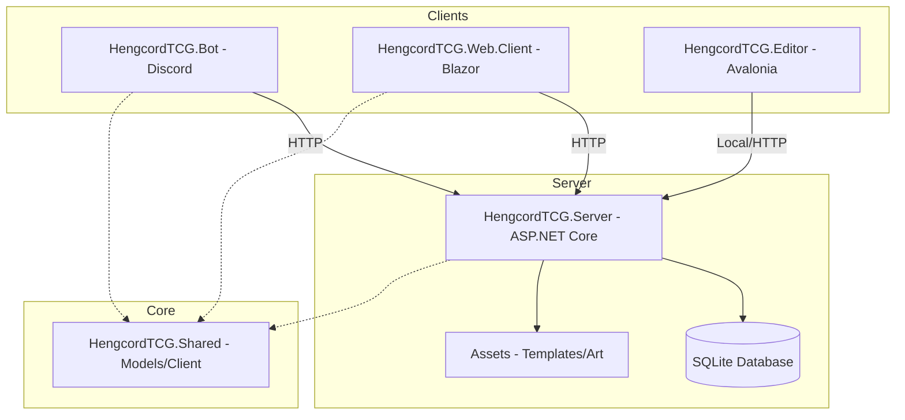

# HengcordTCG - Digital Trading Card Game Ecosystem

HengcordTCG is a full-stack digital trading card game ecosystem featuring a Discord bot interface, a centralized server, a card editor, and a future web frontend.

## Architecture Overview

The project is built using a decoupled, API-first architecture. All business logic and data persistence are handled by the Server, which exposes a RESTful API consumed by other components.



## Project Components

### 🖥️ [HengcordTCG.Server](file:///d:/Projects/TCGBot/HengcordTCG.Server)
The backbone of the system.
- **Technology**: ASP.NET Core 9.0
- **Responsibilities**: User management, Shop logic, Trade orchestration, Card database, Image generation.
- **API Docs**: Modern interactive documentation powered by [Scalar](https://localhost:7156/scalar/v1) (Development mode).

### 🤖 [HengcordTCG.Bot](file:///d:/Projects/TCGBot/HengcordTCG.Bot)
The primary user interface via Discord.
- **Technology**: Discord.Net
- **Features**: 
    - `/daily` - Claim daily rewards.
    - `/balance` - Check gold.
    - `/shop` - Buy card packs.
    - `/trade` - Interactive marketplace.
    - Autocomplete support for cards and packs.

### 🎨 [HengcordTCG.Editor](file:///d:/Projects/TCGBot/HengcordTCG.Editor)
A desktop application for game designers to create and edit card templates.
- **Technology**: Avalonia UI
- **Features**: Visual positioning, rarity management, art selection, and live card preview.

### 📦 [HengcordTCG.Shared](file:///d:/Projects/TCGBot/HengcordTCG.Shared)
Common logic shared across all projects.
- Contains Entity Framework models.
- Includes `HengcordTCGClient` for standardized API communication.
- `CardImageService` for dynamic card rendering.

## Setup Instructions

### Prerequisites
- .NET 9.0 SDK
- Discord Bot Token

### Running the Ecosystem

1. **Start the Server**:
   ```bash
   cd HengcordTCG.Server
   dotnet run
   ```
   *Note: Ensure the `Assets` folder exists in the project root.*

2. **Run the Bot**:
   ```bash
   cd HengcordTCG.Bot
   dotnet run
   ```
   *Note: Configure `Token` and `GuildId` in `appsettings.json`.*

3. **Launch the Editor**:
   ```bash
   cd HengcordTCG.Editor
   dotnet run
   ```

## Development
- **Database**: Uses SQLite (`data/bot.db`).
- **Assets**: All card templates, fonts, and art are stored in the `Assets/` directory.
- **Decoupling**: The Bot project has NO direct database access; it communicates exclusively via the Server API.

---
*Created with ❤️ by the HengcordTCG Team.*
