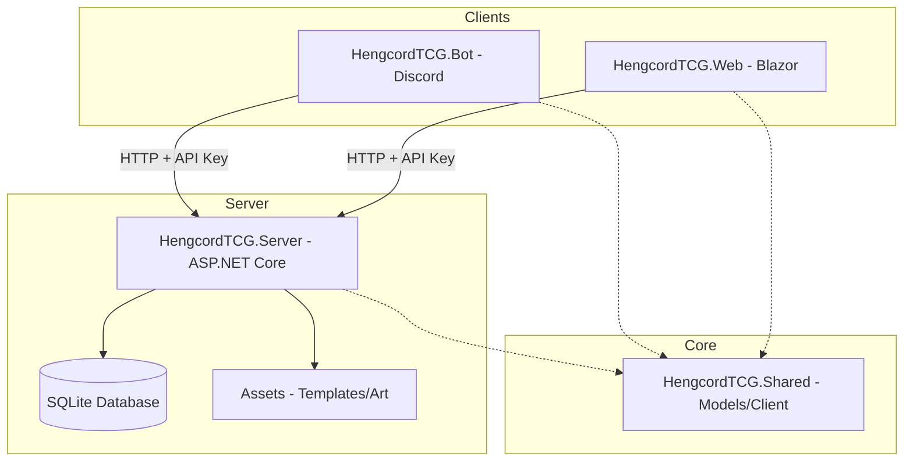

# HengcordTCG - Digital Trading Card Game Ecosystem

HengcordTCG is a full-stack digital trading card game ecosystem featuring a Discord bot interface and a centralized API server.

## Architecture Overview

The project is built using a decoupled, API-first architecture. All business logic and data persistence are handled by the Server, which exposes a RESTful API consumed by other components.



## Project Components

### 🖥️ [HengcordTCG.Server](file:///d:/Projects/TCGBot/HengcordTCG.Server)
The backbone of the system.
- **Technology**: ASP.NET Core 9.0
- **Responsibilities**: User management, Shop logic, Trade orchestration, Card database, Image generation.
- **API Docs**: Modern interactive documentation powered by [Scalar](https://localhost:7156/scalar/v1) (Development mode).

### 🤖 [HengcordTCG.Bot](file:///d:/Projects/TCGBot/HengcordTCG.Bot)
The primary user interface via Discord.
- **Technology**: Discord.Net
- **Features**: 
    - `/daily` - Claim daily rewards.
    - `/balance` - Check gold.
    - `/shop` - Buy card packs.
    - `/trade` - Interactive marketplace.
    - Autocomplete support for cards and packs.
- **Authentication**: Uses API Key (X-API-Key header) for secure communication with Server.

### 📦 [HengcordTCG.Shared](file:///d:/Projects/TCGBot/HengcordTCG.Shared)
Common logic shared across all projects.
- Contains Entity Framework models.
- Includes `HengcordTCGClient` for standardized API communication.
- `CardImageService` for dynamic card rendering.

## Setup Instructions

### Prerequisites
- .NET 9.0 SDK
- Discord Bot Token
- (See [ENV_SETUP.md](ENV_SETUP.md) for configuration details)

### Running the Ecosystem

1. **Start the Server** (required for all other components):
   ```bash
   cd HengcordTCG.Server
   dotnet run
   ```
   - API available at `http://localhost:5266`
   - API Documentation (Scalar): `http://localhost:5266/scalar` (Development mode)

2. **Run the Discord Bot**:
   ```bash
   cd HengcordTCG.Bot
   dotnet run
   ```
   - Configure Discord token and Guild ID in environment variables or `appsettings.json`
   - See [ENV_SETUP.md](ENV_SETUP.md) for configuration

3. **Launch the Web Application** (optional, in development):
   ```bash
   cd HengcordTCG.Web
   dotnet run
   ```
   - Web UI available at `http://localhost:5000`
   - Requires Discord OAuth configuration

## Development
- **Database**: Uses SQLite (`data/bot.db`)
- **API Keys**: All clients authenticate with Server using X-API-Key header (configure in environment variables)

---
*Created with ❤️ by the HengcordTCG Team.*
